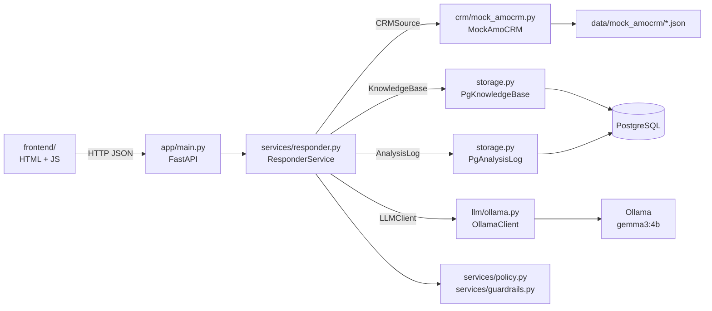

# Архитектура

## Слои



| Слой | Файл | Отвечает за | Не знает о |
|---|---|---|---|
| API | `app/main.py` | валидация входа, HTTP-коды, сборка зависимостей | промпте, SQL |
| Бизнес-логика | `app/services/responder.py` | выбор статей, вызов LLM, повтор, проверки, журнал | Ollama, amoCRM, PostgreSQL |
| Правила | `app/services/policy.py`, `guardrails.py` | темы здоровья и жалобы, выдуманные цены, утечки разметки | — |
| Промпт | `app/prompts.py` | системный промпт, JSON-схема, сборка контекста | транспорте |
| Интерфейсы | `app/ports.py` | `LLMClient`, `CRMSource`, `KnowledgeBase`, `AnalysisLog` | реализациях |
| LLM-адаптер | `app/llm/ollama.py` (+ `fake.py` для тестов) | HTTP к Ollama, structured output, ошибки | бизнес-правилах |
| CRM-адаптер | `app/crm/mock_amocrm.py` | формат amoCRM → доменный `Dialog` | LLM |
| Хранилище | `app/storage.py`, `migrations/` | CRUD и поиск по базе знаний, журнал анализов | LLM |

`ResponderService` получает зависимости через конструктор и видит только протоколы из `app/ports.py`.
В тестах в него подставляются `FakeLLM` и база знаний в памяти — без Ollama и PostgreSQL.

## Поток запроса `POST /api/analyze`

1. **CRM → Dialog.** `CRMSource.get_dialog(lead_id)` возвращает сообщения с ролями `client` / `manager`.
   Новые сообщения клиента — хвост диалога после последнего ответа менеджера. Если последним писал
   менеджер, отвечать не на что — `409`.
2. **Отбор статей.** Полнотекстовый поиск PostgreSQL (`russian`, веса: заголовок > ключевые слова > текст)
   по сообщениям клиента, новые идут с двойным весом. К двум лучшим статьям добавляются товары из их
   `related_slugs` — это источник для допродажи: клиент о них не спрашивал, поиском по его тексту
   они бы не нашлись. В промпт попадает до 7 статей.
3. **Сигналы.** `policy.detect` ищет по ключевым словам темы здоровья (беременность, лекарства, дети…)
   и жалобы. Сигналы передаются модели в блоке `<signals>`.
4. **LLM.** Системный промпт + контекст с разметкой `<knowledge_base>`, `<dialog_history>`,
   `<new_client_messages>`. Ответ ограничен JSON-схемой через параметр `format` Ollama.
   Невалидный JSON или пустой ответ — один повтор; недоступность Ollama — сразу `503`.
5. **Проверки кодом** (`guardrails.apply`):
   - суммы в рублях из ответа, которых нет в переданных статьях, → предупреждение
     (в подсказке менеджеру разрешены суммы двух цен: «вместе 3 080 ₽»);
   - ссылки на несуществующие статьи убираются;
   - служебные теги промпта, `[id=N]` и «перетёкшие» поля схемы вырезаются из ответа клиенту;
   - товары, которые упомянуты в ответе клиенту, но не встречались в переписке, → предупреждение
     (допродажу предлагает менеджер, а не черновик ответа);
   - при теме здоровья или жалобе допродажа отключается, при теме здоровья — `needs_manager = true`;
   - ответ без опоры на базу знаний → `needs_manager = true`.
6. **Журнал.** Диалог, результат, модель и время пишутся в `analyses`.

## Данные

```sql
kb_articles (id, slug UNIQUE, kind, title, content, price_rub, keywords, related_slugs text[],
             search tsvector GENERATED … STORED  -- GIN-индекс)
analyses    (id, lead_id, source, dialog jsonb, kb_ids int[], result jsonb, warnings jsonb,
             model, latency_ms, created_at)
```

Схема — Alembic-миграция на чистом SQL (`backend/migrations/versions/0001_initial.py`).
База знаний заливается из `data/kb_seed.json` (`python -m app.seed`, `--reset` — привести к файлу)
и редактируется через `/api/kb` и вкладку «База знаний».

## Почему без RAG, векторной БД и LangChain

База знаний — 14 статей. Полнотекстовый поиск PostgreSQL со стеммингом находит нужные статьи
во всех сценариях, работает в той же базе, объясним (`/api/kb/search?q=…` показывает, что попадёт
в промпт) и не требует модели эмбеддингов. Вся база целиком тоже поместилась бы в контекст,
но на CPU/слабой GPU каждые лишние 1 000 токенов промпта — это секунды ожидания,
поэтому отбор оставлен. Если статей станет сотни — `KnowledgeBase` заменяется на реализацию
с `pgvector` без изменения сервиса.

## Решения в промпте

- **Порядок полей схемы = порядок рассуждения:** `client_intent` → `manager_already_did` →
  `used_kb_ids` → `needs_manager` → `customer_reply` → `upsell_appropriate` → `upsell_hint`.
  Маленькая модель сначала формулирует, чего хочет клиент и что уже сделал менеджер, и только
  потом пишет тексты. Эти поля видит менеджер в интерфейсе — видно, как модель поняла диалог.
- **Роли размечены явно** (`[Клиент]` / `[Менеджер]`), история и новые сообщения — в разных блоках.
- **Разделение ответа и подсказки:** ответ клиенту не содержит допродажу — решение за менеджером;
  подсказка не должна повторять то, что менеджер уже предлагал или от чего клиент отказался
  (сценарий 30004).
- **Нет факта — не угадывать:** «уточню и вернусь» + `needs_manager = true` (сценарий 30003).
- **Здоровье:** продукты — БАД, никаких медицинских обещаний; беременность, дети, лекарства —
  к врачу (сценарий 30006). Промпт + жёсткое правило в коде.
- **Один пример ответа (few-shot)** на ситуацию, которой нет в демо-сценариях. Без него gemma3:4b
  писала подсказку фигурными скобками и затягивала ответ; с ним прогон вырос с 2/12 до 8/12.
- `temperature = 0.2`, `think = false` для моделей с режимом рассуждений.

## Замена mock amoCRM на реальный amoCRM

Бизнес-логика работает с интерфейсом `CRMSource` и доменным `Dialog` — меняется только адаптер
и способ запуска анализа.

1. **Адаптер** `app/crm/amocrm.py` с тем же интерфейсом:
   - авторизация — OAuth 2.0 интеграции amoCRM (access/refresh token, поддомен аккаунта);
   - `get_dialog(lead_id)`: сделка и контакт — `GET /api/v4/leads/{id}?with=contacts`;
     переписка — из источника, подключённого к аккаунту (Chats API amoCRM / события чата,
     либо собственное хранилище сообщений, которое пополняется вебхуками);
   - маппинг автора: сообщение от контакта → `client`, от пользователя amoCRM → `manager`
     (именно это уже делает `MockAmoCRM` на своём JSON).
2. **Триггер.** Вебхук amoCRM о входящем сообщении → новый роут, например `POST /api/amocrm/webhook`,
   который проверяет подпись/секрет, достаёт `lead_id` и вызывает тот же `ResponderService.analyze`.
   Либо виджет в карточке сделки вызывает `POST /api/analyze` с `lead_id` — как демо-страница.
3. **Куда отдать результат.** Ответ клиенту — черновиком в виджет или примечанием к сделке
   (`POST /api/v4/leads/{id}/notes`), подсказку — только менеджеру (примечание/задача), никогда в чат.
4. **Конфигурация.** `CRM_PROVIDER=amocrm` и учётные данные интеграции в `.env`; ветка выбора
   адаптера — в `lifespan` в `app/main.py`.

Точные эндпоинты чатов зависят от того, как в аккаунте подключены каналы, — их нужно сверить
с документацией amoCRM при подключении реального аккаунта. `ResponderService`, промпт,
база знаний и проверки при этом не меняются.

## Замена Ollama на внешний API

Новый класс с методом `generate_json(system, user, schema) -> dict` и атрибутом `model`,
например `app/llm/anthropic.py` (structured output / tool use с той же JSON-схемой) или
OpenAI-совместимый клиент. Выбор — переменной `LLM_PROVIDER` в `lifespan`. Ошибки транспорта
переводятся в `LLMError` (`retryable=True` для невалидного ответа) — повтор и `503` работают как есть.

## Развёртывание

- **Локально:** Ollama на ноутбуке (GPU), PostgreSQL — база `acr_dev` на VPS через SSH-туннель.
- **VPS:** systemd-сервис `acr` (uvicorn на `127.0.0.1:8102`, пользователь `acr`, `MemoryMax=200M`,
  hardening), релизы `releases/<метка>` со своим venv и симлинком `current` — как у CRM на том же
  сервере. У VPS 1 CPU и ~1.5 ГБ свободной памяти, поэтому модель на нём не запускается:
  Ollama ноутбука пробрасывается на сервер обратным SSH-туннелем
  (`ssh -R 11434:127.0.0.1:11434`). Для постоянной работы достаточно указать в `OLLAMA_URL`
  другой хост с Ollama или переключить провайдера на внешний API.
